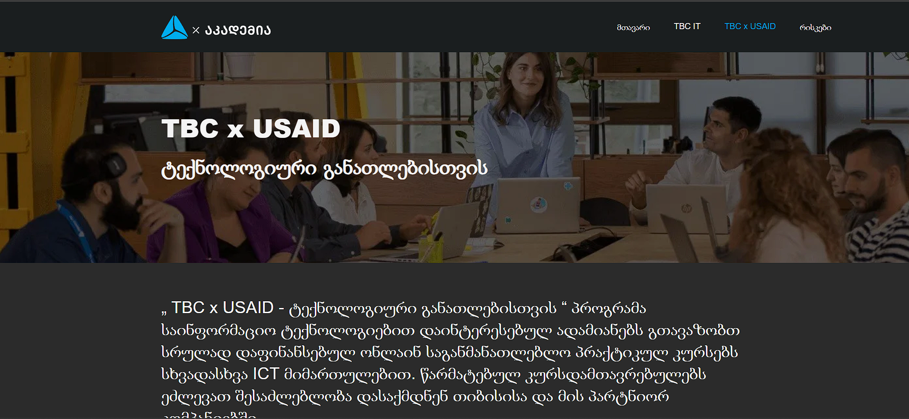

# TBCxUSAID Clone
This project is a clone of the TBCxUSAID webpage using HTML, CSS, and JavaScript.

## Overview

The TBCxUSAID Clone project aims to replicate the design and functionality of the TBCxUSAID webpage, providing a learning opportunity for web developers to practice their skills in HTML, CSS, and JavaScript.

## Features

- **Responsive Design:** The clone is designed to be responsive across various devices and screen sizes.
- **Navigation Menu:** A navigation menu that mirrors the structure of the original TBCxUSAID page.
- **Interactive Elements:** JavaScript is used to implement interactive elements such as dropdown menus or sliders if present on the original page.
- **Styling:** CSS is applied to replicate the visual design and layout of the TBCxUSAID webpage.

## Usage

[Clone Link](https://tbcxusaid-clone.netlify.app/)

## Contributing

Contributions are welcome! If you'd like to contribute to this project, please fork the repository, make your changes, and submit a pull request.

## Credits

- TBCxUSAID website: [Original Page](https://www.tbcacademy.ge/usaid)
- Author: [Levan](https://github.com/tankistttt)
